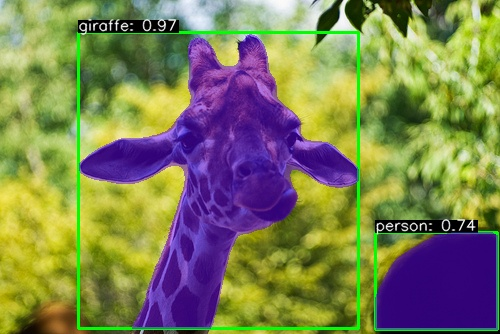

# Real-Time Object Detection / Segmentation in C++ with YOLO and Onnx Runtime
An example of using Yolo with the Onnx runtime in C++ that 
goes along with my blog post on [Medium](https://medium.com/@taffealexander/object-detection-with-yolo-and-onnx-runtime-in-c-c8bfb964520b).

# Requirements:
- ONNX Runtime
- OpenCV
- Cmake
- C++ compiler
- CUDA Toolkit / cuDNN (GPU Only)
 
See the [object detection article](https://medium.com/@taffealexander/object-detection-with-yolo-and-onnx-runtime-in-c-c8bfb964520b) on Medium for more details.

# Project Structure:

 - **c++** - Contains the C++ example code for object detection and segmentation using ONNX runtime.
 - **python** - Contains the python scripts for converting pytorch weights to ONNX format and object segmentation using ONNX runtime.
 - **images** - Contains sample images used in the blog post.
 - **labels** - Contains the class names for the YOLO model trained on COCO dataset.
 - **weights** - Contains the weights for the YOLO object detection / segmentation model trained on COCO dataset from Ultralytics.

# Speed Test
    Here is the breakdown of the results of the speed test:
#### GPU: GeForce RTX 4070
#### Model: YOLOv11n
### C++
#### **Filename**: video_test.cpp

| Task                         | Average Latency (ms) |
|------------------------------|----------------------|
| Pre-processing               | 6                    |
| Inference                    | 6                    |
| Bounding Box Post-processing | 1                    |
| Mask Post-processing         | 3                    |
| Drawing Boxes / Masks        | 1                    |
| Total loop time              | 20                   |

| Frames per second |
|-------------------|
| 50                |

### Python
#### **Filename**: video_test.cpp

| Task                         | Average Latency (ms) |
|------------------------------|----------|
| Pre-processing               |          |
| Inference                    |          |
| Bounding Box Post-processing |          |
| Mask Post-processing         |          |
| Drawing Boxes / Masks        |          |
| Total loop time              |          |

| Frames per second |
|--------------|
|              |
